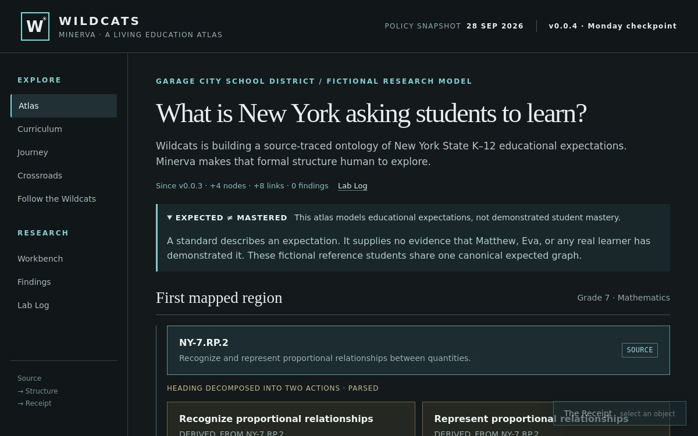

# Monday output assessment

September 29, 2026 · builder reassessment of Monday's work and the subsequent public-interface pass.

**Verdict: the defined Monday foundation deliverables exist and the bounded source trace is sound. The implementation is not yet ready for broad semantic expansion without stronger acceptance checks.** Source acquisition can continue separately. The prior M7 independent audit remains a real, scoped audit; this assessment is a new builder review and does not extend its sign-off.

Reviewed local commit: `47deb88`; full research tree: `6fe90ce2f52a362401038982ede551cd4d83b302`. The 64 tracked files matched GitHub `main` byte-for-byte by Git blob identity at review. Public Site version 8 was confirmed active/public with a successful deployment. The reviewed published source is `0330ad62646237358200f9e5ac2098324ee093ba`.

## Actual result, without inflated coverage

- Two acquired mathematics PDFs; 184 extracted pages; four selected evidence images.
- One modeled family: NY-7.RP.2 and a–d. Six parsed expectations; 15 nodes and 22 relationships.
- Twelve content areas inventoried; eleven still await full-document acquisition. Full primary-document targets remain unresolved for Arts, Science, Technology Education, and World Languages.
- Thirteen grade positions and graduation/transition navigation; only one Grade 7 mathematics family populated.
- Zero inferred prerequisite edges, cross-disciplinary findings, or observed-mastery records.
- Exact edition/cohort applicability and human semantic review remain unresolved.

The strongest output is the evidence discipline: original wording remains distinguishable from parsing, empty areas remain empty, source arrows were not promoted into prerequisites, and corrections survive in the record. The largest implementation weakness is that these written rules are stronger than the programmatic acceptance controls.

## Gate-by-gate assessment

| Gate | Assessment | Evidence and qualification |
| --- | --- | --- |
| M1: scope freeze | Delivered | All five requested deferrals and evidence-based closure rules are recorded. The later interface expansion was explicitly requested by Willis. |
| M2: foundation specification | Delivered; needs a current-state editorial pass | All requested project rules are explained. The document distinguishes requirements from enforcement. Historical 0.0.3 tables and current amendments make the present state harder to read than necessary. |
| M3: source inventory | Delivered as an acquisition inventory | Twelve records have source leads, explicit unknowns, and next actions. It is not an acquired or date-verified corpus. Most web evidence is still search-excerpt-only. |
| M4: reusable ingestion | Delivered for local PDF intake | Pinned processing, immutable bundles, hashes, selected images, and separate review queues work on both PDFs. Downloading and OCR are not implemented; source registration still needs an operator and publication copies remain manual. |
| M5: semantic trace | Delivered for NY-7.RP.2 | Reinspection of page 90 confirms heading/a–d, all five representation contexts, graph-point qualifiers, example, non-exhaustive strategies, and modeling note. Automated qualifier protection is weaker than the current content itself. |
| M6: K–12 scaffold | Delivered as navigation | Both avatars have identical expectations at all thirteen grades; transition abstains from a diploma decision. This is not a completed thirteen-year learning model. |
| M7: audit and repairs | Delivered within its recorded scope | Separate Astra High reviewer, exact baseline, reviewed patch digest, repairs, and limits are preserved. The patch digest was rechecked. Later interface changes were builder-reviewed, not independently re-audited. |
| M8: publication | Delivered | Native deployment succeeds; current audience is public; local and GitHub files match. A full desktop/mobile interaction and accessibility pass remains open. |

The Monday checkboxes are supportable as scoped delivery gates. They should not be read as comprehensive specification compliance, mature scientific coverage, or a production-quality sign-off.

## Findings, in repair order

### 1. Acceptance checks allow unsupported model states

**Priority: before adding more ontology claims.**

In isolated temporary copies, with the baseline validated first, `scripts/validate.py` accepted each of the following: replacing a relation with `UNSUPPORTED_RELATION`; removing a standard's `source_locator`; and setting a grade-assigned standard to `REJECTED`. A DOM probe also confirmed that the rejected standard remained in `standardsForGrade(7)`.

The current graph contains no rejected standards or invented relation used by these probes. This is an observed guardrail gap, not a claim that the published graph is corrupted. The specification already discloses missing generalized acceptance enforcement; the probes demonstrate the practical consequence.

Required repair: define allowed relations and endpoint types; enforce required provenance fields; distinguish accepted expectations from rejected, contested, and unresolved candidates in the projection. Evidence-view access to rejected records may remain available, but inclusion in the canonical expected set must not be automatic. Add negative tests that verify these cases are rejected or explicitly excluded.

Locations: `scripts/validate.py` status/reference checks; `dist/app.js` `standardsForGrade`; `schema/ontology.schema.json` is skeletal and is not invoked by the validator.

### 2. Existing tests can miss loss of parsed meaning

**Priority: before semantic expansion.**

Deleting every qualifier from the parsed unit-rate expectation passed both the validator and `scripts/test_receipts.js`. The receipt test searches the entire rendered Receipt, so the unchanged verbatim source quote supplies the words it expects even when the structured parsing has lost them.

The actual published qualifier list is correct. Required repair: assert parsed action/object/qualifier fields separately from retained source text, with targeted cases for the five representations, the graph points and unit-rate qualifier, and the non-exhaustive strategy interpretation. A source quote must not mask a broken structured interpretation.

The single PARSED Concept also has a parent pointer but no explicit `parsing_rationale`; the validator currently requires rationale only for Expectation nodes. Make the requirement consistent with the provenance contract rather than relying on generic UI copy.

### 3. Current review/publication state is fragmented

**Priority: current clarity and trust.**

Eight current nodes and eight current edges still carry `independent-and-human-review-pending`. Journey metadata also says independent review is pending. The independent audit record correctly records PASS; Receipt prose supplies a hard-coded explanation of that later audit. Some current documentation still says the public Site is on the earlier checkpoint. The mathematics inventory's next action still includes completing the already completed bounded trace.

Historical M5/M7 review records should retain their original as-of states. Current records and views should resolve them through explicit review/publication references, with separate independent and human-review states. Do not rewrite historical evidence or claim the later interface pass received M7's independent review.

The Receipt's page-90 evidence link and audit explanation are also tailored to this one family. Before expanding subjects, derive both from the selected record; otherwise new objects could inherit an irrelevant page or audit claim.

### 4. Two concrete interaction gaps remain

**Priority: next interface repair.**

- Clicking navigation before the JSON loads produces `Cannot read properties of undefined (reading 'release')`. The app recovered after the test data resolved, but loading-state interaction is unguarded. Existing arrival-order tests do not exercise a user click during loading.
- “See this through a student” from the proportional-relationship Concept opens Grade 7 without highlighting the concept or a related expectation, because that Concept is not rendered as a student-view object. Map it to its supported expectation records or explain the contextual selection visibly.

The Mathematics Subject is also isolated in the current graph. Its neighborhood contains one node and zero links. This is a real modeling/navigation gap, not permission to invent a hierarchy: define and source the missing subject relation before adding it.

### 5. The visual brief is substantially implemented, not fully verified

**Priority: a bounded rendered-browser pass.**

The native deployment supplied a 1200 × 750 desktop screenshot, inspected for this assessment. It confirms the dark field, typography, cyan instrumentation, Explore/Research split, readable version, actual source object, and collapsed Receipt column. It also shows the inactive fixed Receipt control overlapping part of a parsed-expectation card. The larger project ambition is below the first trace, so the first viewport explains identity more clearly than eventual capability.

The new interaction tests cover DOM behavior, not mobile layout, zoom, focus visibility, touch behavior, or screen-reader output. The grade coverage labels are only 10px on desktop and 11px on mobile in CSS; these are important status labels and merit a readability check. No comprehensive accessibility pass is claimed.

### 6. Implementation is functional but unnecessarily brittle

**Priority: before this interface grows materially.**

`interface.js` saves the old render/Receipt functions, runs them, then replaces their output. It also rewrites review prose with string replacement. There are therefore two sets of view templates, redundant DOM construction, and presentation logic tied to exact wording. The current tests pass; this is maintainability risk rather than a demonstrated data corruption.

Consolidate rendering into one path with small functions and data-derived review/release state. Keep the current visual system. Generate public JSON copies and status summaries from the canonical records so scale does not amplify drift.

## Verification record and limits

Passed again: seven ingestion regression tests; repository validator; original six expectation Receipt checks; all eight DOM views; all fifteen object Receipts; bounded graph expansion; contextual expectation-to-student navigation; thirteen grades for both avatars; transition abstention; matrix expansion; Receipt controls; script/data arrival-order checks; JavaScript syntax; and whitespace checks.

The archived full-source page 90 was visually reinspected against the model. The exact M7 repair patch still hashes to `2fb6dbe780d3c6268ee3a61519cf8f5c3980862ec5d116f54da5c391c4501209`. All 64 research files matched remote Git blob identities. The local deployment archive's fifteen public asset files match the current checkout; the remaining archive entry is packaging configuration.

The provider-reported stored-archive content hash is preserved in the publication record, but it does not equal the local gzip-byte hash or the locally decompressed tar hash. The provider-stored archive could not be retrieved through the available file-download tool, so this assessment does not claim an independent byte-for-byte check of that stored archive. This is an unresolved packaging-hash representation check, not evidence of changed educational content or a failed deployment. A future receipt should identify the hash representation explicitly and retain both local-package and provider-reported digests when different.

No new NYSED policy verification was attempted: unknown applicability remains unknown. No live product, source assertion, ontology, or historical audit outcome was changed during assessment. Negative probes ran only in temporary copies or in-memory DOM fixtures. Their results are preserved in `data/reviews/monday-output-assessment.json`.

## Assessment of the work and reporting

The source trace, clean separation of expectation from mastery, retained corrections, and recoverable research record are useful foundations. Semantic coverage remains extremely small. I should have paired “Monday is closed” with a clear readiness statement: **the planned foundation demonstration is delivered; wider semantic production still needs stronger acceptance controls and current-state reconciliation.**

The next pass should repair findings 1–3, address the two interaction failures, and complete a bounded rendered-browser check. Primary document acquisition can proceed in parallel with those repairs. Adding large amounts of parsed content first would multiply avoidable provenance and review-state problems.
